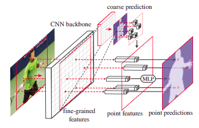
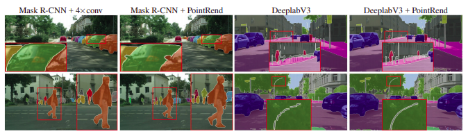

# PointRend-Paddle
[English](README.md) | 简体中文
   
   * [PointRend](#pointrend)
      * [一、简介](#一简介)
      * [二、复现精度](#二复现精度)
      * [三、数据集](#三数据集)
      * [四、环境依赖](#四环境依赖)
      * [五、快速开始](#五快速开始)
         * [step0: install](#step0-安装必要依赖)
         * [step1: clone](#step1-clone)
         * [step2: 训练](#step2-训练)
         * [step3: 评估](#step3-评估)
         * [使用预训练模型预测](#使用预训练模型预测)
      * [六、代码结构与详细说明](#六代码结构与详细说明)
         * [6.1 代码结构](#61-代码结构)
         * [6.2 参数说明](#62-参数说明)
         * [6.3 训练流程](#63-训练流程)
            * [单机训练](#单机训练)
            * [多机训练](#多机训练)
      * [七、模型信息](#七模型信息)

## 一、简介

论文“PointRend: Image Segmentation as Rendering(CVPR2020)”的PointRend的Paddle实现版本。
本项目利用百度的paddlepaddle框架对CVPR2020论文PointRend进行了复现。Note：这里只做在Cityscapes数据集上的对于SemanticFPN+PointRend的语义分割实验，不包括MaskRCNN+PointRCNN的实例分割实验. 验证基于paddle复现的PointRend的正确性。
项目依赖于paddleseg工具。

**PointRend With Seg Architecture:**






**论文地址:** [PointRend: Image Segmentation as Rendering](https://arxiv.org/abs/1912.08193)

## 二、复现精度

| Model                   | mIOU |
| ----------------------- | -------- |
| SemanticFPN+PointRend(原文Pytorch)     | 78.5     |
| SemanticFPN+PointRend(本项目Paddle) | 78.78  |

## 三、数据集

使用的数据集为：[Cityscapes](https://www.cityscapes-dataset.com/)

- 数据集大小：19个类别的密集像素标注，5000张1024*2048大小的高质量像素级注释图像/20000个弱注释帧
  - 训练集：2975个图像
  - 验证集：500个图像
  - 测试集：1525个图像
  
数据集应有的结构:
```
data/
├── cityscapes
│   ├── gtFine
│   │   ├── test
│   │   ├── train
│   │   └── val
│   ├── leftImg8bit
│   │   ├── test
│   │   │   ├── berlin
│   │   │   ├── ...
│   │   │   └── munich
│   │   ├── train
│   │   │   ├── aachen
│   │   │   ├── ...
│   │   │   └── zurich
│   │   └── val
│   │       ├── frankfurt
│   │       ├── lindau
│   │       └── munster
│   ├── train.txt
│   ├── val.txt
│   ├── test.txt

```

.txt是利用Paddleseg提供的数据集处理工具生成，其风格如下:

```leftImg8bit/test/mainz/mainz_000001_036412_leftImg8bit.png,gtFine/test/mainz/mainz_000001_036412_gtFine_labelTrainIds.png```

利用PaddleSeg's create_dataset_list.py(需要先克隆[PaddleSeg](https://github.com/PaddlePaddle/PaddleSeg)):
 
```
python PaddleSeg/tools/create_dataset_list.py ./data/cityscapes/ --type cityscapes --separator ","

```
当然，需要首先生成xxxxx_gtFine_labelTrainIds.png标签。这个需要利用cityscapes提供的工具生成,具体使用方法这里不作介绍，请查阅[Cityscapes](https://www.cityscapes-dataset.com/)

## 四、环境依赖

- 硬件：XPU、GPU、CPU

- 框架：
  - PaddlePaddle >= 2.0.2

## 五、快速开始

项目基于Paddleseg开发,除`train.py`经过修改外，其余`val.py`、`predict.py`同Paddleseg使用方式一致。模型和自定义损失函数定义位于paddleseg/models目录下。
### step0: 安装必要依赖

```bash
pip install -r requirements.txt
``` 

### step1: clone 

``` bash
# clone this repo (注意：可能需要切换分支)
git clone git@github.com:CuberrChen/PointRend-Paddle.git
```

### step2: 训练
训练采用加入默认开启的warmup学习率策略加Momentum优化器。具体可在`train.py`查看181行。若关闭,采用.yml中的策略。
``` bash

# 多卡V100*4训练 
export CUDA_VISIBLE_DEVICES=0,1,2,3 
python -m paddle.distributed.launch train.py --config configs/pointrendfpn/pointrend_resnet101_os8_cityscapes_512×1024_80k.yml --num_workers=16 --use_vdl --do_eval --save_interval 1000 --save_dir output
```
```
# 单卡训练 暂时未试过 因此需要根据具体配置情况调整学习率和batch_size以及iters
python train.py --config configs/pointrendfpn/pointrend_resnet101_os8_cityscapes_512×1024_80k.yml--num_workers 4 --use_vdl --do_eval --save_interval 1000 --save_dir output --batch_size 4

```

### step3: 评估

预训练模型默认路径为'output/best_model/model.pdparams'
```bash
# 评估  
CUDA_VISIBLE_DEVICES=0 
python val.py --config configs/pointrendfpn/pointrend_resnet101_os8_cityscapes_512×1024_80k.yml --model_path output/best_model/model.pdparams
```

### 使用预训练模型预测

利用预训练模型进行图像的测试,具体使用请查阅[Paddleseg文档](https://paddleseg.readthedocs.io/zh_CN/release-2.1/index.html)

使用样例如下：

```bash
# 使用预训练模型预测
python predict.py \
       --config configs/pointrendfpn/pointrend_resnet101_os8_cityscapes_512×1024_80k.yml \
       --model_path output/best_model/model.pdparams \
       --image_path data/xxx/JPEGImages/0003.jpg \
       --save_dir output/result
```

## 六、代码结构与详细说明

### 6.1 代码结构

```
├── README.md
├── README_EN.md
├── images/ # 存放README需要的图像
├── data/ #数据路径
├── paddleseg/ # paddleseg套件包含models等
├── utils/ # 工具
├── lr_scheduler/ # 自定义学习率策略
├── output/ # 输出目录
├── run.sh # AIStudio多卡训练脚本 
├── ... 
├── train.py # 训练
├── eval.py # 评估
└── predict.py # 预测
```

### 6.2 参数说明

具体的参数设置（主要是config文件的修改）请参阅[Paddleseg文档](https://paddleseg.readthedocs.io/zh_CN/release-2.1/index.html)

这里唯一需要注意的地方是，warmup的参数暂时在train.py中查看。

模型的参数设定(可在config文件中进行输入参数值)请参考`paddleseg/models/pointrendseg.py`，这部分需要使用者参照论文悉知含义。

### 6.3 训练流程

#### 单机训练
```bash
# 单卡训练 暂时未试过 因此需要根据具体配置情况调整学习率和batch_size
python train.py --config configs/pointrendfpn/pointrend_resnet101_os8_cityscapes_512×1024_80k.yml--num_workers 4 --use_vdl --do_eval --save_interval 1000 --save_dir output --batch_size 4
```

#### 多机训练（TODO）
```bash
# 多卡V100*4训练 
export CUDA_VISIBLE_DEVICES=0,1,2,3 
python -m paddle.distributed.launch train.py --config configs/pointrendfpn/pointrend_resnet101_os8_cityscapes_512×1024_80k.yml --num_workers=16 --use_vdl --do_eval --save_interval 1000 --save_dir output
```
## 七、模型信息

关于模型的其他信息，可以参考下表和复现分析：

| 信息 | 说明 |
| --- | --- |
| 发布者 | xbchen |
| 时间 | 2021.08 |
| 框架版本 |  PaddlePaddle >= 2.0.2 |
| 应用场景 | 图像分割 |
| 支持硬件 | XPU、GPU、CPU |
| 下载链接 | [PointRendFPN: 提取码：b8ai](https://pan.baidu.com/s/1RXgac1j1bYn76Yx0fTbQfw)|
| 在线运行项目 | [AIStudio notebook]() 待做|

特别感谢百度paddle提供的平台和资源。

**SemanticFPN+PointRend模型复现分析**：

- 采用80000 iter，batch_size=16 for 4 GPUs(4 imgs for per gpu)，base_lr=0.01 warmup+poly的学习率策略，**SemanticFPN+PointRend with ResNet101模型在Cityscaps VAL数据集上达到了78.78的mIOU**。***说明：采用这个方案的原因是因为该训练设定下AIStudio提供的四卡脚本环境允许的1024×512输入最大的batch_size不到32(原文32)，若内存够用/使用多卡，还是推荐使用作者提供的参数。训练好的模型在最下面有链接。训练代码、train_0.log（78.78miou完整训练日志,位于ouput文件夹）都已经上传到仓库。* AIStudio上暂未公开项目，链接稍后公开提供。

Refrence:
- [Paper Official PyTorch](https://github.com/facebookresearch/detectron2/tree/master/projects/PointRend)
